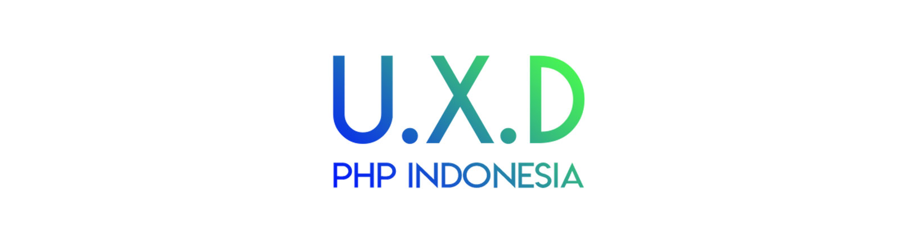

# Pengenalan

Halo, selamat bergabung di **UXD | PHP Indonesia** sebuah komunitas di bawah naungan PHP Indonesia yang berfokus pada tema UI / UX & Frontend Developer. Hari ini Minggu (12 / 01) 2018 adalah pertama kalinya komunitas **UXD | PHP Indonesia** mengadakan workshop. Sebelumnya perkenalkan nama saya **Muhibbudin Suretno** founder dan admin group UXD, saat ini saya bekerja sebagai Sr. Frontend Developer di sebuah marketplace perhiasan online di Jakarta.

Dan pada workshop pertama ini saya akan membawakan materi mengenai **Design To HTML**, dengan fokus pada pembuatan struktur template dan responsive web design.

#### Daftar Isi

- [Pengenalan](?id=pengenalan)
- [Daftar Isi](?id=daftar-isi)
- [Inisialisasi proyek](?id=inisialisasi-proyek)
- [Memahami struktur proyek](?id=memahami-struktur-proyek)
- [Berkenalan dengan SASS / SCSS](?id=berkenalan-dengan-sass-scss)
- [Membuat Navbar](?id=membuat-navbar)
- [Membuat Section Hero](?id=membuat-section-hero)
- [Membuat Section Introduction](?id=membuat-section-introduction)
- [Membuat Section Services](?id=membuat-section-services)
- [Membuat Section Promotion](?id=membuat-section-promotion)
- [Membuat Section Prices](?id=membuat-section-prices)
- [Membuat Section Client Says](?id=membuat-section-client-says)
- [Membuat Section Footer](?id=membuat-section-footer)
- [Membuat Copyright](?id=membuat-copyright)
- [Kesimpulan](?id=kesimpulan)
- [Penutup](?id=penutup)

#### Inisialisasi proyek

Sebelum memulai anda di wajibkan menyiapkan environment dan software yang akan kita butuhkan, diantaranya seperti di bawah ini :

- [Git](https://git-scm.com/downloads)
- [Ruby SASS](https://sass-lang.com/install)

> Jika anda belum pernah memakai Ruby sebelumnya, silahkan download & install terlebih dahulu melalui [tautan berikut.](https://www.ruby-lang.org/id/documentation/installation/)

Selanjutnya anda dapat men–download source skeleton yang akan kita gunakan pada proyek ini dengan cara seperti berikut :

- Menggunakan GIT via SSH :
  `$ git clone git@github.com:muhibbudins/uxd-workshop.git`
- Menggunakan GIT via HTTPS :
  `$ git clone https://github.com/muhibbudins/uxd-workshop.git`
- Men-*download* langsung dari *source* :
  [klik disini](https://github.com/muhibbudins/uxd-workshop/archive/master.zip)

Setelah semuanya selesai, silahkan buka skeleton yang sudah di download serta buka **Command prompt / Terminal** pada folder tersebut. Lalu jalankan _Ruby SASS_ dengan command berikut :

``` bash
$ sass --watch scss/main.scss:css/main.css
```

#### Memahami struktur proyek

Berikut adalah struktur folder yang akan kita gunakan pada proyek ini :

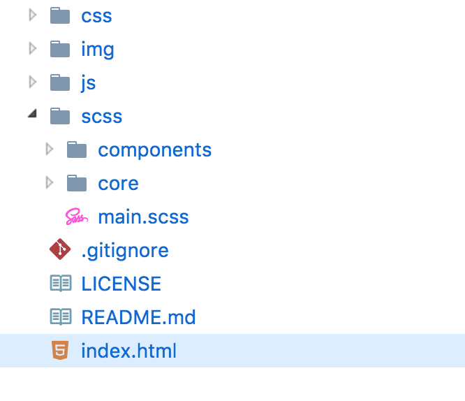

Pada gambar di atas kita dapat melihat beberapa folder di antaranya **css, img, js, scss** serta beberapa file seperti **.gitignore, LICENSE, README.md** dan **index.html** dengan keterangan sebagai berikut :

- **css** : Folder dimana hasil compile file .scss di simpan _(destination directory)_
- **img** : Folder untuk menyimpan asset file hasil slicing dari desain
- **js** : Folder untuk menyimpan semua script JavaScript yang digunakan pada aplikasi
- **scss** : Folder utama untuk file SASS dengan format .scss
- **index.html** : File utama yang akan di panggil oleh browser

> Hanya file _main.scss_ pada folder **scss** yang akan di compile dan pada folder ini berisi sub folder **components** & **core** yang menjadi tempat kita menyimpan file .scss yang nantinya di panggil pada file main.scss

#### Berkenalan dengan SASS / SCSS

SASS adalah sebuah CSS Preprocessor yang cukup populer saat ini karena kemudahan dalam pengaplikasiannya pada proyek besar maupun kecil, SASS memiliki dua format file yang cukup berbeda secara syntax yaitu **.sass** & **.scss** perbedaan yang cukup mencolok itu adalah syntax **.sass** tidak mendukung penggunaan { bracket } dan ; (semi-colon) seperti bahasa ibunya yaitu Ruby. Namun berbeda dengan syntax **.scss** yang secara struktur 100% sama dengan file CSS pada umumnya, tapi dengan beberapa keunggulan lain yang tidak ada pada bahasa CSS biasa.

Berikut adalah contoh penggunaan SASS dengan syntax (format) **.scss** :

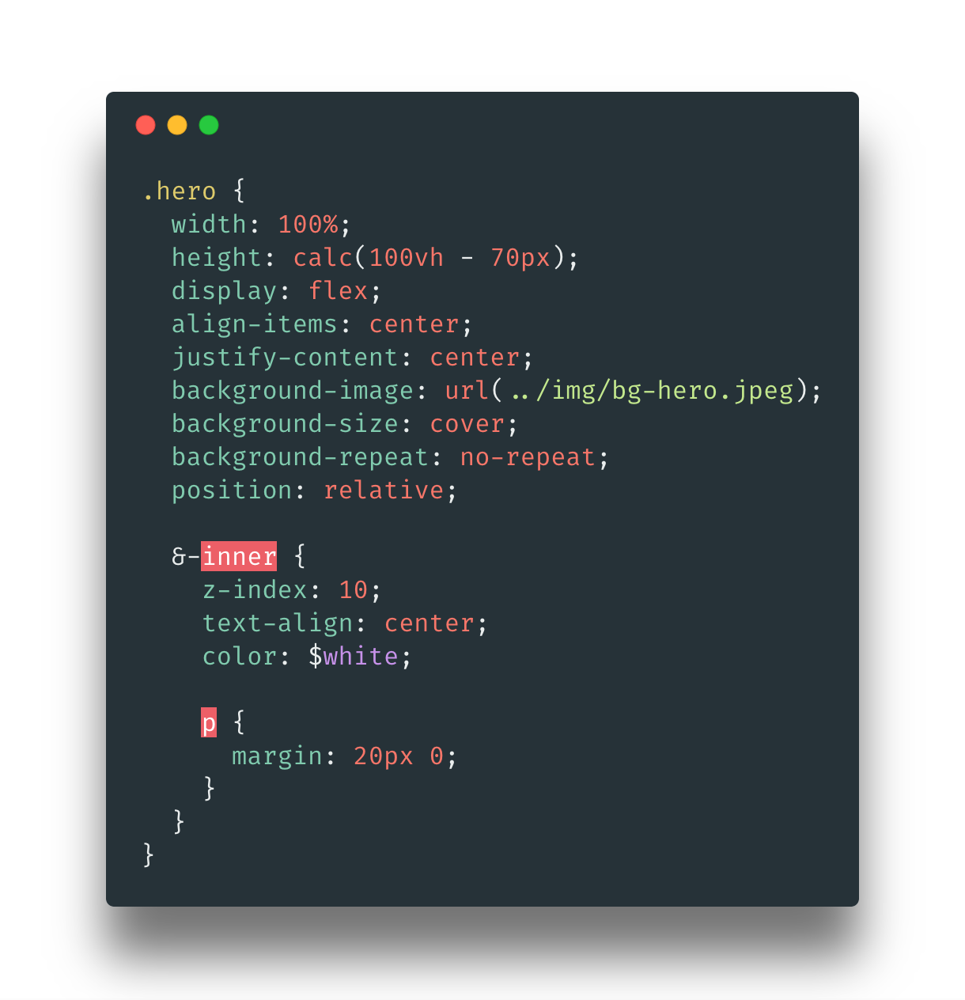

Sangat mirip dengan CSS bukan? bedanya hanya pada bentuk _nesting_. Jika pada syntax CSS kita biasa melakukan _nesting_ seperti ini :

``` scss
.foo {
  color: blue;
}
.foo.bar {
  background-color: red;
}
.foo.bar > p {
  font-size: 16px;
}
```

Maka pada SCSS kita dapat mempersingkatnya menjadi seperti ini :

``` scss
.foo {
  color: blue;

  &.bar {
    background-color: red;

    &> p {
      font-size: 16px;
    }
  }
}
```

Dengan menggunakan SASS / SCSS kita dapat mempersingkat menulis ulang class **.foo** serta child—nya, selain itu masih ada lagi kelebihan lain saat kita menggunakan SASS / SCSS sebagai CSS Pre-processor contohnya :

- [Conditional](http://sass-lang.com/documentation/file.SASS_REFERENCE.html#if)
- [Loop](http://sass-lang.com/documentation/file.SASS_REFERENCE.html#for)
- [Array](http://sass-lang.com/documentation/file.SASS_REFERENCE.html#each-directive)
- [Mixin (Function)](http://sass-lang.com/documentation/file.SASS_REFERENCE.html#mixins)

> Selengkapnya bisa anda pelajari pada [link berikut.](http://sass-lang.com/guide)

#### Membuat Navbar

Selanjutnya yang akan kita buat pertama adalah bagian **navbar**, desainnya adalah seperti berikut :

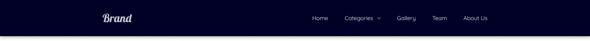


#### Membuat Section Hero

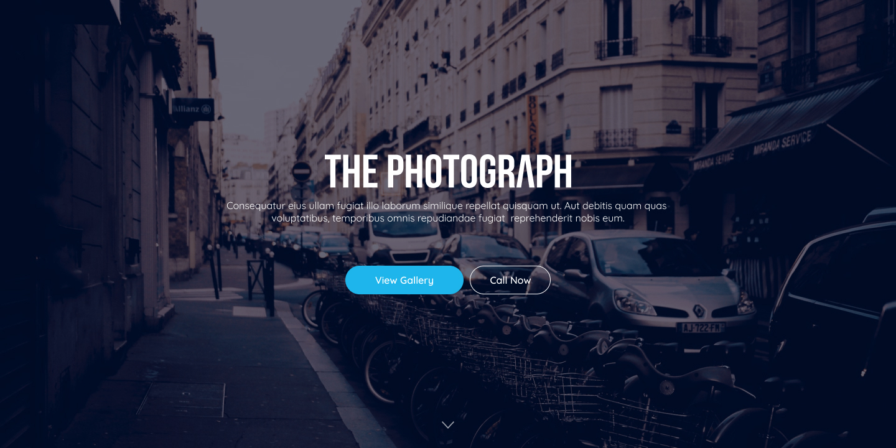

#### Membuat Section Introduction

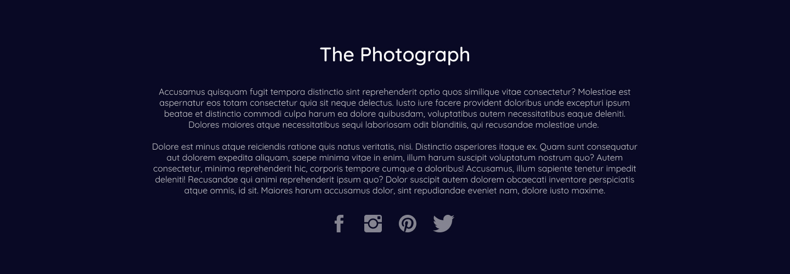

#### Membuat Section Services

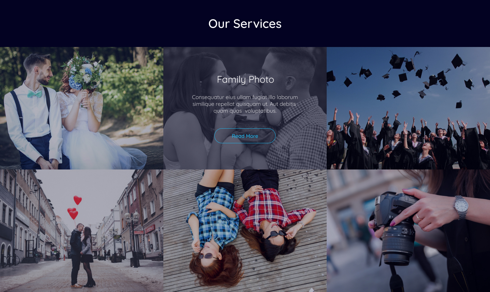

#### Membuat Section Promotion

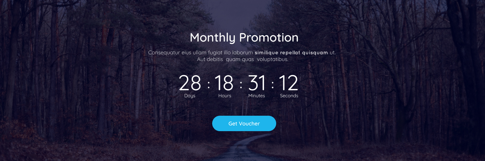

#### Membuat Section Prices

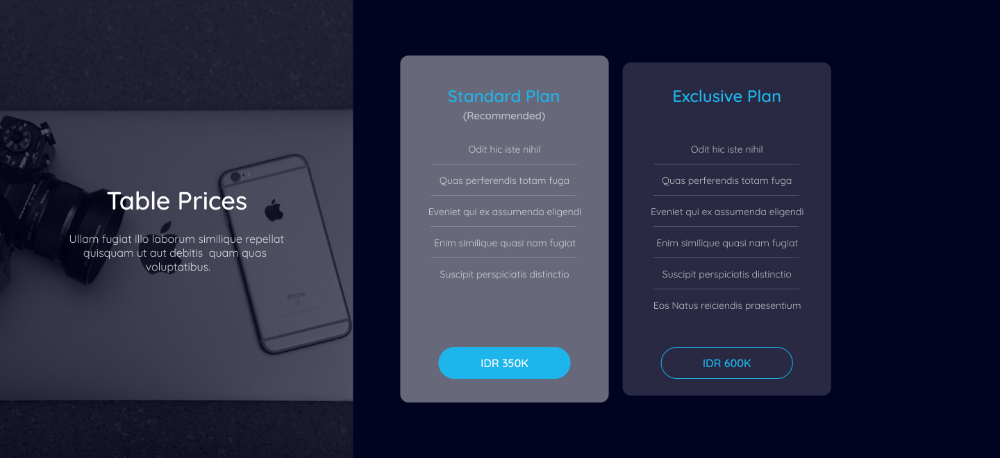

#### Membuat Section Client Says

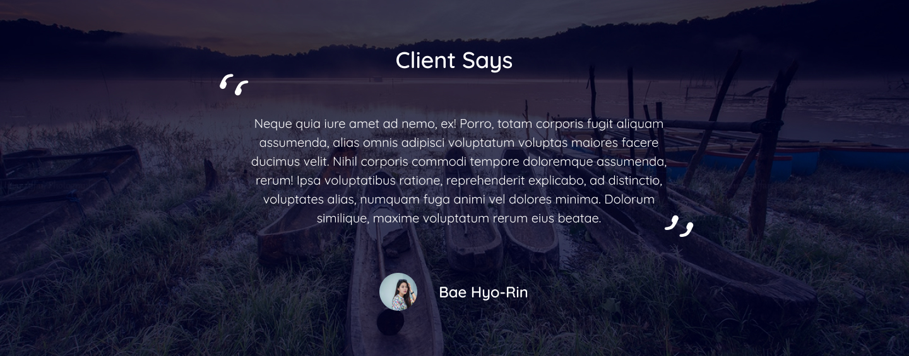

#### Membuat Section Footer

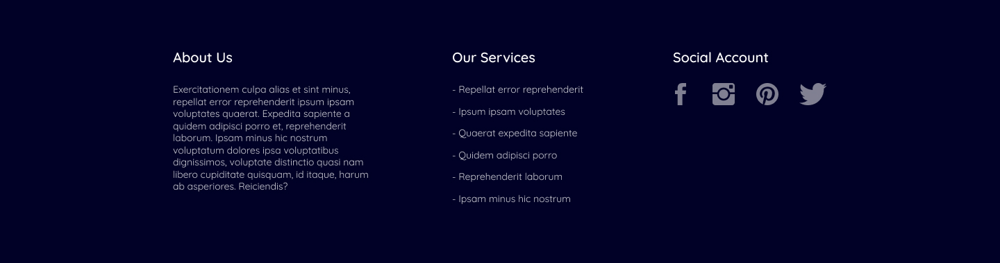

#### Membuat Copyright

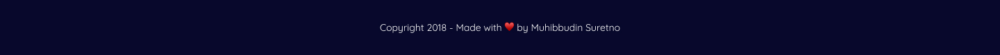

#### Kesimpulan


#### Penutup

